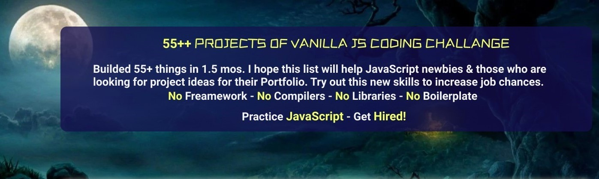

  
 

# 55+ Project of Vanilla JS Coding Challange

HTML/CSS/JavaScript

Starter Files + Completed solutions for the JavaScript 55 days Challanges

## 55+ vanilla js projects content

This is the main repository for all of the projects in this coding challange.

So, Feel free to start Learning and if you want to add something new!

| SL No. | Project | Live Demo | Source Code |
| ------ | ------- | --------- | ------------|
| 01 | Expanding Cards      | [Link here](https://mohammad-asif-web.github.io/55-plus-vanilla-js-project/projects/01-expanding_cards/main.html) | [ Github](https://github.com/Mohammad-Asif-Web/55-plus-vanilla-js-project/tree/master/projects/01-expanding_cards) |
| 02 | Progress Steps       | [Link here](https://mohammad-asif-web.github.io/55-plus-vanilla-js-project/projects/02-progress_steps/main.html) | [ Github](https://github.com/Mohammad-Asif-Web/55-plus-vanilla-js-project/tree/master/projects/02-progress_steps) |
| 03 | Rotating Navigation  | [Link here](https://mohammad-asif-web.github.io/55-plus-vanilla-js-project/projects/03-rotating_navigation/main.html) | [ Github](https://github.com/Mohammad-Asif-Web/55-plus-vanilla-js-project/tree/master/projects/03-rotating_navigation) |
| 04 | Hidden Search Widget | [Link here](https://mohammad-asif-web.github.io/55-plus-vanilla-js-project/projects/04-hidden_search_widget/main.html) | [ Github](https://github.com/Mohammad-Asif-Web/55-plus-vanilla-js-project/tree/master/projects/04-hidden_search_widget) |
| 05 | Blurry Loading       | [Link here](https://mohammad-asif-web.github.io/55-plus-vanilla-js-project/projects/05-blurry_loading/main.html) | [ Github](https://github.com/Mohammad-Asif-Web/55-plus-vanilla-js-project/tree/master/projects/05-blurry_loading) |
| 06 | Scroll Animation     | [Link here](https://mohammad-asif-web.github.io/55-plus-vanilla-js-project/projects/06-scroll_animation/main.html) | [ Github](https://github.com/Mohammad-Asif-Web/55-plus-vanilla-js-project/tree/master/projects/06-scroll_animation) |
| 07 | Split Landing Page   | [Link here](https://mohammad-asif-web.github.io/55-plus-vanilla-js-project/projects/07-split_landing_page/main.html) | [ Github](https://github.com/Mohammad-Asif-Web/55-plus-vanilla-js-project/tree/master/projects/07-split_landing_page) |
| 08 | Form Wave Animation  | [Link here](https://mohammad-asif-web.github.io/55-plus-vanilla-js-project/projects/08-form_wave_animation/main.html) | [ Github](https://github.com/Mohammad-Asif-Web/55-plus-vanilla-js-project/tree/master/projects/08-form_wave_animation) |
| 09 | Sound Board          | [Link here](https://mohammad-asif-web.github.io/55-plus-vanilla-js-project/projects/09-sound_board/main.html) | [ Github](https://github.com/Mohammad-Asif-Web/55-plus-vanilla-js-project/tree/master/projects/09-sound_board) |
| 10 | Dad Jokes            | [Link here](https://mohammad-asif-web.github.io/55-plus-vanilla-js-project/projects/10-dad_jokes/main.html) | [ Github](https://github.com/Mohammad-Asif-Web/55-plus-vanilla-js-project/tree/master/projects/10-dad_jokes) |
| 11 | Event Key Codes      | [Link here]() | [ Github](https://github.com/Mohammad-Asif-Web/55-plus-vanilla-js-project/tree/master/projects/11-event_keycodes) |

### This repository includes Others Resources
- [Figma Prototype Design](https://www.figma.com/file/rIWv47olnEhfYw7rJeuwHG/JavaScript-Fifty-%2B%2B?node-id=0%3A1)
- [My Website Info](https://muhammadasif10.blogspot.com)
- [Code With Zonayed](https://zonayed.js.org/)
- [Anisul Islam](https://www.youtube.com/c/anisulislamrubel)
- [JS Bangladesh](https://www.youtube.com/c/JSBangladesh)

### Other Repository for Ultimate JavaScript Solutions

- [JavaScript Basic Explanations](https://github.com/Mohammad-Asif-Web/Javascript-Basic-Explanations)

## NOTE ON PULL REQUESTS:

All of these projects are part of this repository. While I do appreciate people trying to make some things prettier or adding new features, we are only accepting pull requests and looking at issues for bug fixes so that the code stays inline with the course

## LICENSE

[The MIT License](/LICENSE)

Copyright (c) 2021 Muhammad Asif  
https://muhammadasif10.blogspot.com

Permission is hereby granted, free of charge, to any person obtaining a copy of this software and associated documentation files (the "Software"), to deal in the Software without restriction, including without limitation the rights to use, copy, modify, merge, publish, distribute, sublicense, and/or sell copies of the Software, and to permit persons to whom the Software is furnished to do so, subject to the following conditions:  

The above copyright notice and this permission notice shall be included in all copies or substantial portions of the Software.

